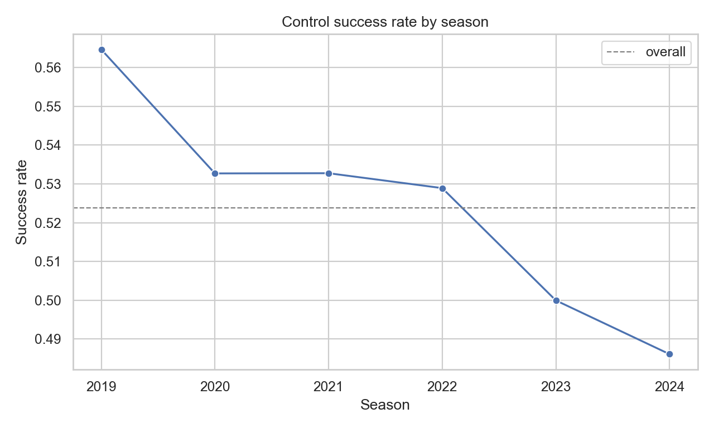
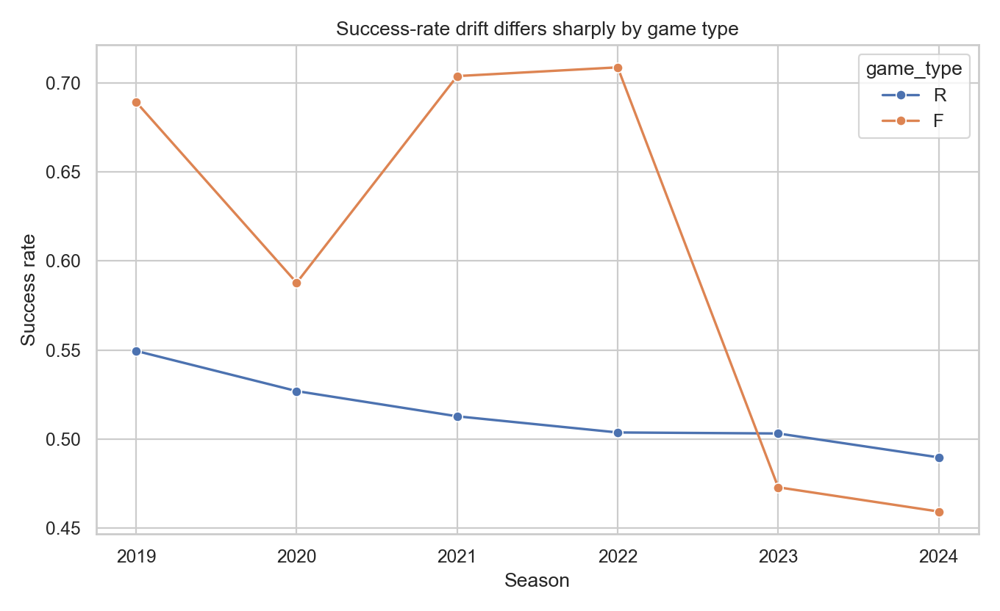
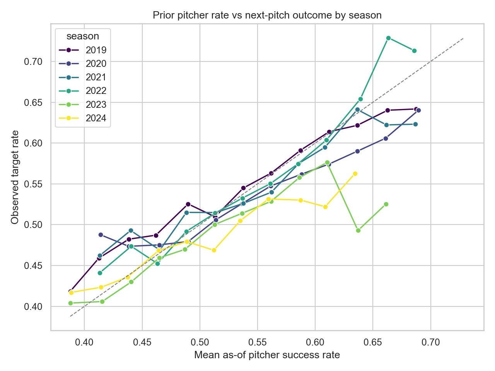
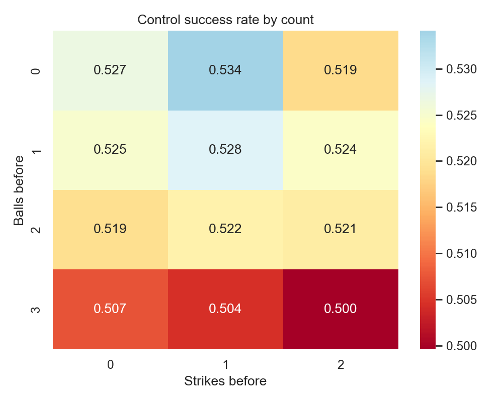
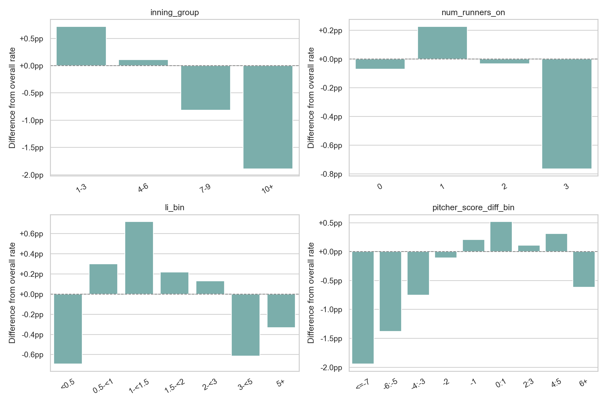
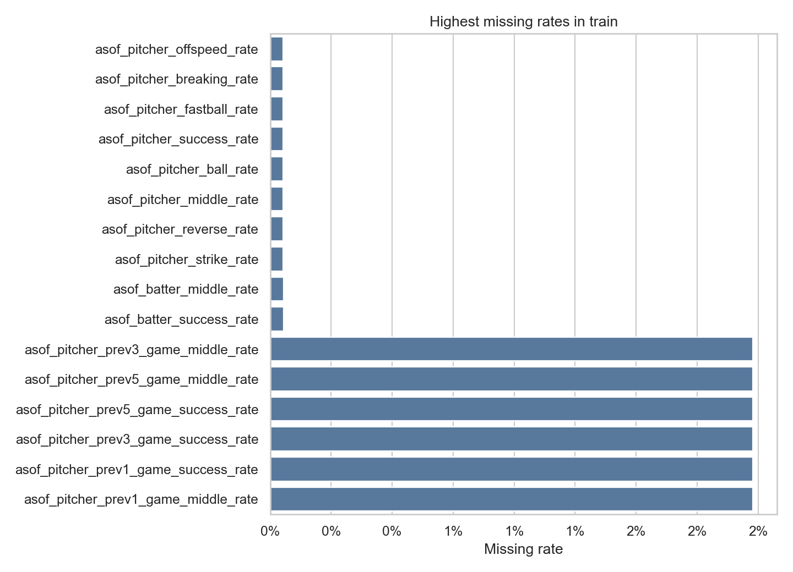
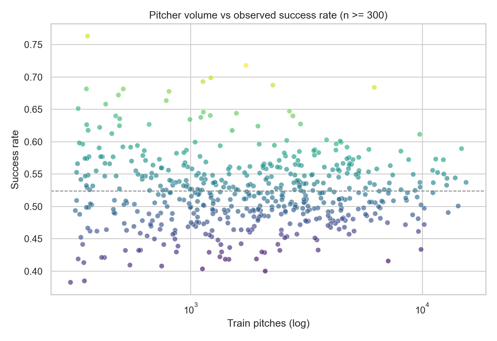
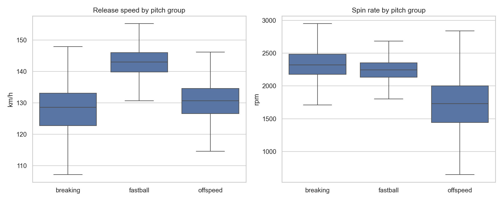

# 투구 단위 제구 성공 확률 예측 EDA 보고서

분석 대상은 `train.csv` 전체 1,475,092행, `trackman_history.csv` 전체
1,793,078행이다. 공개 `test.csv` 5행은 형식 확인에만 사용했다. 대회 규칙에
따라 평가 데이터 내부 집계, 빈도, rolling, target encoding은 분석·피처 설계에서
제외했다.

## 1. 결론부터

가장 큰 모델링 위험은 결측이나 클래스 불균형이 아니라 **시간에 따른 타깃 분포
변화**다.

- 전체 제구 성공률은 **52.38%**(성공 772,603 / 실패 702,489)로 거의 균형이다.
- 연도별 성공률은 2019년 **56.47%**에서 2024년 **48.61%**로 7.86%p
  하락했다.
- `game_type=F`는 2022년 **70.87%**에서 2023년 **47.29%**로 급변한다.
  구성 변화, 기록/라벨링 체계 변화, 다른 모집단 효과가 섞였을 가능성이 있으므로
  원인으로 단정할 수는 없지만 모델에는 매우 강한 regime shift다.
- 가장 강한 수치형 단변량 신호는 `asof_pitcher_success_rate`이나 타깃과의
  Pearson 상관도는 **0.0843**에 불과하다. 이 문제는 단일 선형 효과보다
  비선형성, 선수 이질성, 연도·경기유형·상황 상호작용이 중요하다.
- 2025 평가는 2019~2024 학습 기간의 바깥이다. 무작위 분할보다
  **연도 순방향 검증**이 필수다.
- `trackman_history`의 선수 ID와 메인 데이터 선수 ID는 직접 겹치지 않는다
  (투수 0명, 타자 0명). 제공된 키만으로 선수 단위 직접 결합하는 방식은 사용할 수
  없다.



## 2. 데이터 구성과 기본 기준선

| 항목 | 값 |
|---|---:|
| 학습 행 / 컬럼 | 1,475,092 / 49 |
| 입력 피처 | 47개 (`row_id`, target 제외) |
| 성공 / 실패 | 772,603 / 702,489 |
| 전체 성공률 | 0.523766 |
| 고유 투수 / 타자 | 792 / 830 |
| Trackman 행 / 컬럼 | 1,793,078 / 30 |
| Trackman 고유 투수 / 타자 | 906 / 913 |

모든 행에 전체 성공률만 예측하는 상수 기준선은 Log Loss **0.6920**, Brier
Score **0.2494**다. 제공 자료에는 공식 평가 지표가 명시되어 있지 않으므로 대회
페이지의 지표를 별도로 확인해야 한다. 그 전까지는 Log Loss를 주 지표로, Brier
Score·ROC-AUC·calibration curve를 보조 지표로 함께 보는 것이 안전하다.

## 3. 타깃과 시간 변화

| 시즌 | 행 수 | 성공률 |
|---:|---:|---:|
| 2019 | 237,413 | 56.47% |
| 2020 | 244,087 | 53.27% |
| 2021 | 247,088 | 53.28% |
| 2022 | 247,472 | 52.89% |
| 2023 | 245,525 | 50.00% |
| 2024 | 253,507 | 48.61% |

`game_type`의 전체 성공률은 R 51.40%, F 60.33%지만, 이 평균만 사용하면 잘못된
결론을 내릴 수 있다. F의 연도별 성공률이 45.93~70.87%로 매우 크게 움직이기
때문이다. `season × game_type`을 명시적 상호작용으로 주거나 이 상호작용을 잘
학습하는 트리 기반 모델이 필요하다.



`asof_pitcher_success_rate`는 과거 누적 성공률 구간이 0.40~0.45일 때 다음 투구
성공률 44.90%, 0.60~0.65일 때 59.02%, 0.65 이상일 때 64.63%로 단조적인 핵심
신호다. 최근 3경기 성공률 역시 0.40 미만 46.19%에서 0.65 이상 61.26%로
상승한다.

다만 같은 과거 누적 성공률에 대한 다음 투구 성공률이 시즌마다 다르다. 특히
2023~2024 관측치는 높은 과거 성공률 구간에서 누적률보다 낮아지는 경향이 있다.
따라서 `asof_*_rate`를 이미 보정된 확률로 간주하지 말고 일반 피처로 사용해야
하며, 최신 시즌 기반 확률 보정이 필요하다.



## 4. 상황별 패턴

### 볼-스트라이크 카운트

- 가장 높은 구간은 0-1의 **53.41%**다.
- 3볼 이후에는 3-0 **50.73%**, 3-1 **50.44%**, 3-2 **49.96%**로 낮다.
- 카운트의 단순 숫자 두 개보다 `balls_before × strikes_before` 상호작용이 더
  자연스럽다.



### 이닝, 점수, 주자, 중요도

- 1~3회 53.10% → 7~9회 51.56% → 연장 50.49%로 내려간다. 투수 구성 차이와
  피로 효과가 함께 섞인 관측 연관성이다.
- 투수 팀이 7점 이상 뒤진 구간은 50.43%, 0~1점 앞선 구간은 52.90%다.
- 만루는 51.61%로 전체보다 0.76%p 낮지만, 주자 수만의 효과는 전반적으로 작다.
- LI 효과는 단조적이지 않다. 1~1.5 구간은 전체보다 +0.72%p, 0.5 미만은
  -0.69%p다. LI 단독 효과보다 이닝·점수차와의 상호작용을 봐야 한다.
- 손 유형 코드 조합 중 `P1-B1`은 49.09%, `P1-B2`는 53.75%다. 코드 1/2의
  실제 좌·우 의미는 설명서에 명시되지 않았으므로 임의로 이름을 붙이지 않았다.



## 5. 결측과 cold-start

결측은 모두 `asof_*` 이력 변수에 집중된다.

| 결측 그룹 | 결측 행 | 비율 |
|---|---:|---:|
| 직전 1/3/5경기 성공률·middle rate | 29,185 | 1.98% |
| 투수 누적 rate / pitch-mix rate | 792 | 0.054% |
| 타자 누적 rate | 830 | 0.056% |

누적 투수 rate 결측 792행은 `asof_pitcher_n=0`, 타자 rate 결측 830행은
`asof_batter_n=0`인 cold-start와 대응한다. 최근 3경기 rate 결측 행의 성공률은
55.08%, 값이 있는 행은 52.32%다. 결측을 중앙값 하나로만 채우면 “이력 없음”이라는
신호를 잃는다.

- 각 이력 변수에 `is_missing` 지시자를 추가한다.
- 누적률은 `n / (n + k)` 신뢰도 가중치와 함께 사용한다.
- cold-start fallback은 전체 평균 하나보다 `season/game_type/hand matchup`처럼
  과거 학습 데이터에서 계산한 계층적 prior가 적합하다.
- 2019년 최근 경기 변수 결측률은 5.17%로 다른 시즌보다 높다. 결측 효과와 시즌
  효과를 분리해야 한다.



## 6. 선수 이질성과 ID 처리

학습 투구 1,000개 이상인 투수들의 관측 성공률은 40.02~71.80%로 폭이 크다.
타자도 44.59~68.36%다. 다만 이 값에는 시즌, 경기유형, 상대, 표본 선택 효과가
섞여 있으므로 선수 고유 능력으로 바로 해석하면 안 된다.

공개 test 5행만 보면 투수 5명 중 3명, 타자 5명 중 2명이 학습 데이터에 없다.
표본이 5행뿐이라 실제 2025 unseen 비율을 추정할 수는 없지만, cold-start가 실제로
존재한다는 점은 확인된다.

제공 베이스라인은 `pitcher_id`, `batter_id`, 팀 ID를 연속형 숫자로 Random Forest에
입력한다. ID 크기 순서에는 야구적 의미가 없으므로 임의의 임계값 분할을 만들 수
있다. 다음 중 하나가 더 안전하다.

- ID를 범주형으로 처리하고 unseen 전용 값을 둔 CatBoost 계열 모델
- 시간/OOF 방식으로만 계산한 smoothing target encoding
- 원시 ID 의존도를 낮추고 제공된 `asof_*` 능력 피처를 중심으로 모델링



## 7. 데이터 품질과 중복 표현

`row_id`는 1,475,092개 모두 고유하고 형식 오류가 없다. target 결측도 없으며
0/1만 존재한다. 다음 관계는 전체 행에서 일관된다.

- `run_total_before = run_top_before + run_bot_before`
- `num_runners_on = runner_on_1b + runner_on_2b + runner_on_3b`
- `base_state`는 세 주자 flag와 완전히 일치
- `score_diff_home`은 초/말 점수에서 정확히 유도 가능
- `score_diff_pitcher_team`은 `top_bottom`과 홈 기준 점수차로 정확히 유도 가능
- `home_win_expectancy + away_win_expectancy = 100` (표시 반올림 오차 최대 0.1)
- `asof_pitcher_n = asof_pitcher_pitchmix_n`은 전 행에서 동일
- 세 pitch-mix rate의 합은 결측이 아닌 행에서 1 (저장 반올림 오차 최대 0.000001)

트리 모델은 중복 컬럼을 견딜 수 있지만 중요도가 여러 컬럼으로 분산되고 계산량이
늘어난다. 선형 모델에서는 다중공선성도 커진다. 최소한 `run_total_before`, 세 주자
flag와 `base_state/num_runners_on` 중 일부, 두 기대승률 중 하나,
`asof_pitcher_pitchmix_n`은 중복 피처 후보로 관리하는 편이 좋다.

## 8. Trackman 로그

Trackman 수치 결측률은 대체로 0.42~0.70%다. 2024 평균은 fastball 구속
144.10 km/h·회전수 2,248 rpm, breaking 128.31 km/h·2,345 rpm, offspeed
131.39 km/h·1,721 rpm이다.



주의할 점은 두 가지다.

1. 메인 ID 792/830개와 Trackman ID 906/913개 사이 직접 교집합은 0이다.
   선수 단위 물리 특성을 메인 행에 붙일 공식 키가 없다. Trackman은 우선 연도·손
   유형·구종군 수준의 리그 prior 또는 pitch-mix 기반 간접 피처 연구에만 사용하고,
   근거 없는 선수 매핑은 하지 않아야 한다.
2. Trackman의 fastball 평균 구속은 2019년 141.41에서 2024년 144.10으로 오르고,
   extension 평균은 2021→2022에 1.88→1.74로 변한다. 선수 구성 변화나 측정 체계
   변화 가능성이 모두 있으므로 물리량은 시즌 내 표준화와 연도 상호작용을 함께
   검토해야 한다.

아주 희귀하지만 Trackman 원천 로그에는 정상 범위를 벗어난 상태가 있다: 아웃
카운트 0~2 밖 95행, 0 이하 extension 3행, 80 km/h 미만 구속 9행, 이닝 0 한 행,
볼 4 한 행, 스트라이크 3 한 행이다. 삭제보다 원본 행을 먼저 확인하고, 물리량은
robust clipping 또는 결측 전환을 권한다.

## 9. 권장 검증 설계

무작위 K-fold는 같은 선수의 인접 시즌/경기 패턴과 높은 과거 기준률을 양쪽에
섞어 2025 일반화 성능을 과대평가할 수 있다.

1. Fold A: 2019~2021 학습 → 2022 검증
2. Fold B: 2019~2022 학습 → 2023 검증
3. Fold C: 2019~2023 학습 → 2024 검증
4. 최종 후보 선택은 2024 성능과 2023~2024 안정성을 우선
5. 각 fold에서 전체 지표 외 `game_type`, cold-start, 투수 이력 표본 구간별
   Log Loss/Brier/캘리브레이션을 별도 기록

시간 가중치 또는 최근 2~3시즌 학습 창도 전체 6시즌 학습과 비교해야 한다. F 유형의
regime shift 때문에 오래된 데이터를 무조건 많이 넣는 것이 유리하다고 볼 수 없다.

## 10. EDA에서 바로 이어지는 피처 후보

- `count_state = balls_before × strikes_before`
- `hand_matchup = pitcher_hand × batter_hand`
- `season × game_type`, `season × asof rate`
- `late_inning`, `extra_inning`, `high_li`, `bases_loaded`, `scoring_position`
- `recent3_success - cumulative_success`, `recent1 - recent5` 같은 컨디션 residual
- 누적률과 `n/(n+k)` reliability의 곱, 명시적 cold-start flag
- pitch-mix entropy, fastball 대비 breaking/offspeed 비율
- 확률 모델 학습 후 최신 시간 fold에만 맞춘 Platt/isotonic calibration

타깃 자체가 확률 예측 문제이므로 정확도만 보지 말고 예측 분포, calibration slope,
reliability diagram을 반드시 확인해야 한다.

## 11. 산출물 안내

- `outputs/train_column_profile.csv`: 전체 컬럼 결측·범위·고유값
- `outputs/group_target_rates.csv`: 시즌, 카운트, 상황, 선수, 이력 구간별 성공률
- `outputs/numeric_target_correlations.csv`: 수치형 타깃 상관
- `outputs/missing_rate_by_season.csv`: 시즌별 결측률
- `outputs/invariant_checks.csv`: 파생·중복 관계 검증
- `outputs/test_sample_train_coverage.csv`: 공개 5행의 학습 ID 포함 여부
- `outputs/trackman_column_profile.csv`: Trackman 품질 프로파일
- `outputs/trackman_by_season_pitch_group.csv`: 연도·구종군별 물리량
- `outputs/trackman_quality_checks.csv`: 원천 로그 이상 상태 수
- `outputs/trackman_joinability.json`: 메인/Trackman 직접 결합 가능성
- `outputs/figures/`: EDA 그림 10종

재실행은 `open` 폴더에서 아래처럼 한다.

```powershell
python .\eda\run_eda.py
```

CSV 통계는 전체 행 기준이며, 그림 중 연속형 분포와 calibration만 균일 표본을 사용한다.
